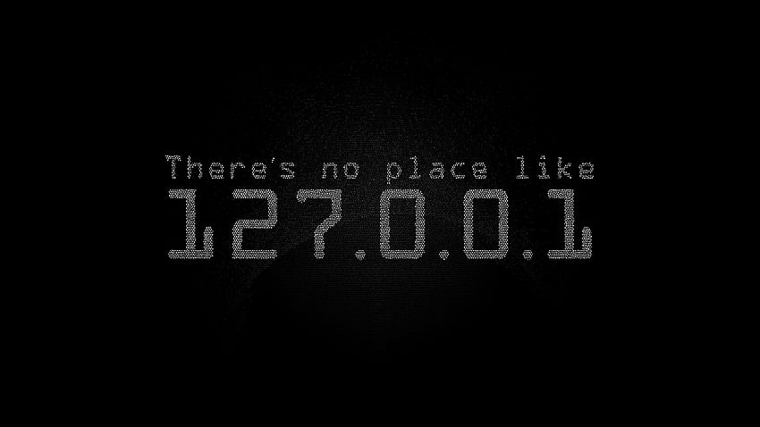

<h2>💫 About Me:</h2>

<h3>I'm just a tech</h3>

I love diving into new technologies and learning how things work under the hood.

---

<h4> Frontend Skills:</h4>

---

<h4> Backend Skills:</h4>

---

<h4> Database Experience:</h4>

---

<h4> Linux Fan? Me too:</h4>

---

<h4>I just learn this fuc*ing shi*t for fun</h4>

---

## 🌐 Connect with Me:
 

